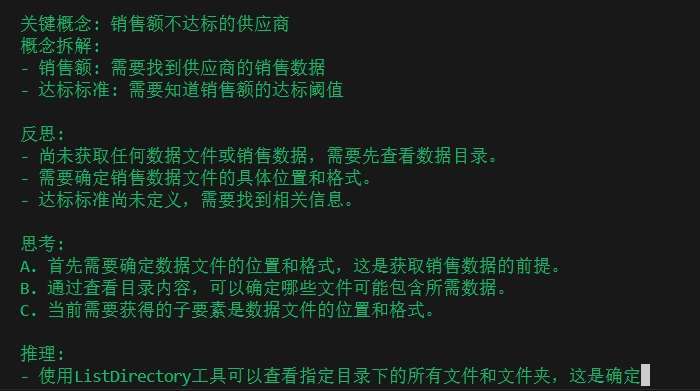
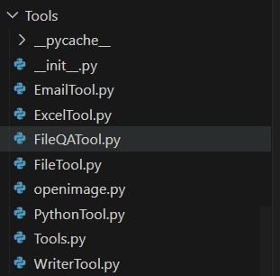
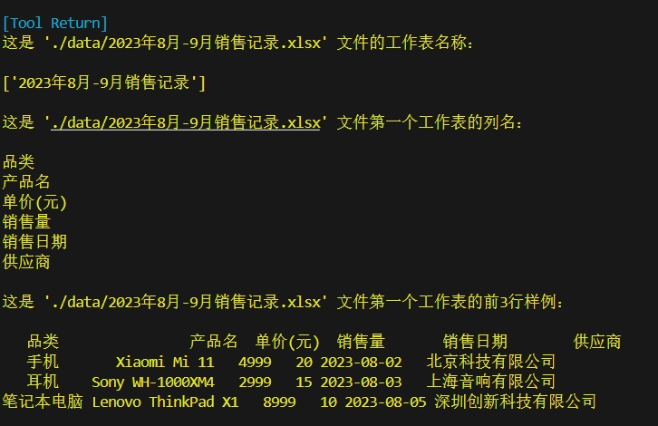

# GPT Automated Multimodal Task Project
**选择中文:** [中文](/readme_CN.md)
**Language:** 
This project demonstrates how to utilize GPT to automatically retrieve files (such as PDF, XLS, Word, etc.) within a repository and complete multimodal tasks. By sending video frames from home cameras into the repository, it can automate the judgment of whether there are dangerous situations at home (leveraging the large model's understanding of the world).

## Simple Operation Demonstration
### Usage Example

After running `main.py`, you can interact with the agent in the command window. The agent can deconstruct key concepts such as "sales not meeting targets" and think about executable actions (such as calling tools) based on the chain of thought technique. The specific thought tree main prompt can be seen in `prompts\main\main.txt`. The output natural language represents concrete thinking, while human brain thinking is sometimes more abstract. The agent's thinking is purely natural language.

### Multi-round Dialogue Task Completion Example
Using the `ListDirectory` tool, as shown, the correct JSON format is output to call the tool and list all files in the repository, which leads to the next round of thinking.

For example, executing the tool "AskDocument" to query another large model to obtain the desired document content.

### Current Tools List

The agent, as the main dispatcher, can call multiple AIs to perform tasks such as sending emails, querying document contents, etc. This method is more suitable for autoagent scenarios than RAG.
- **openimage**: Used to open images in the repository and add them to the dialogue, giving the agent the ability to query images.
- **ExcelTool**: Can retrieve all columns and the first three rows of an Excel sheet, allowing the agent to judge whether the table content is what is needed.

- **PythonTool**: Defines an AI that accepts the agent's query (including the path of the Excel file to be analyzed), allowing the AI to write code and run it to calculate and sum variables in the table for analysis.

Considering that the agent, as the dispatcher, does not occupy the main_prompt token, it saves tokens and avoids forgetting the ultimate goal of completing the user's query due to interspersed multitasks.

### Future Plans
- Add UI to allow image input through the chat window.
- Add parsing for Word or web graphic formats.

## Environment Setup

### Step 1: Set up .env
Configure your own API key in the `.env` file in the project.
`OPENAI_API_KEY=sk-xxxx`
You need to purchase the API key from [here](https://devcto.com/).

### Step 2: Set Local Libraries
Execute the following command:
`export HNSWLIB_NO_NATIVE=1`

### Step 3: Install Dependencies
Execute the following command:
`pip install -r requirements.txt`

### Step 4: Run the Project

##### Run the main.py File

##### Then input the question in the interface:
🤖: How can I help you?
👨: What is the sales figure for September? (You need to input this yourself)
>>>>Round: 0<<<<

##### Example Questions:
* What is the sales figure for September?
* What is the best-selling product?
* Identify suppliers with sales not meeting targets.
* Send an email to these two suppliers notifying them of this.
* Compare the sales performance of August and September and write a report.
* Summarize the contents of the warehouse images.

This is a basic version of multimodal capabilities, further updates are needed due to the langchain version updates.
